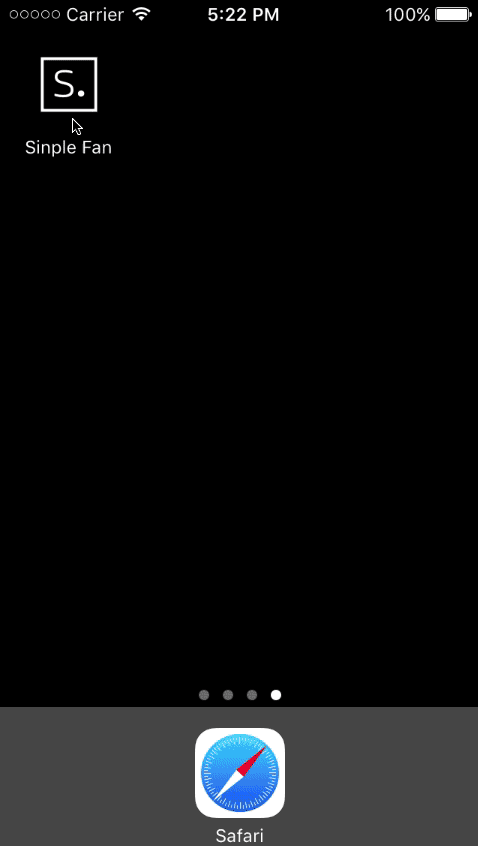

# Sinple Supporter

Sinple Supporter is a dummy app to demonstrate how iOS Alternate Icons work. [This feature](https://developer.apple.com/reference/uikit/uiapplication/2806818-setalternateiconname) was introduced in iOS 10.3 beta1. You can see it in action: 



You should notice that `You have changed the icon for "Sinple Fan"` is a system alert that you cannot avoid. Its purpose is to prevent us from changing the icon without the user knows it. 

## How it works

### Declare
First: you should declare all alternate icons in the `info.plist` file. The problem is that you should abandon the usage of assets catalog for icons. Indeed, this is not compatible with this feature :/. So, in this demo, it gives: 

```
	<key>CFBundleIcons</key>
	<dict>
		<key>CFBundleAlternateIcons</key>
		<dict>
			<key>de</key>
			<dict>
				<key>CFBundleIconFiles</key>
				<array>
					<string>ic_de</string>
				</array>
				<key>UIPrerenderedIcon</key>
				<false/>
			</dict>
			<key>fr</key>
			<dict>
				<key>CFBundleIconFiles</key>
				<array>
					<string>ic_fr</string>
				</array>
				<key>UIPrerenderedIcon</key>
				<false/>
			</dict>
			<key>it</key>
			<dict>
				<key>CFBundleIconFiles</key>
				<array>
					<string>ic_it</string>
				</array>
				<key>UIPrerenderedIcon</key>
				<false/>
			</dict>
		</dict>
		<key>CFBundlePrimaryIcon</key>
		<dict>
			<key>CFBundleIconFiles</key>
			<array>
				<string>ic_none</string>
			</array>
		</dict>
	</dict>
```
	
	
There is 3 alternate icons: 

* _de_ (which is bound to file `ic_de`)	
* _fr_ (which is bound to file `ic_fr`)	
* _it_ (which is bound to file `ic_it`)	

And we have the primary icon (the default one) bound to file `ic_none`. 

### Change
Once the icons are declared, when simply have to call `setAlternateIconName(_:completionHandler:)` on `UIApplication` shared instance with one of the declared icon names. For instance, if we want `it` icon: 

```      
UIApplication.shared.setAlternateIconName("it") { (error) in
	if let error = error {
		print("err: \(error)")
    }
}
```


### Read
If you want to know which icon is currently set up, just read ` alternateIconName`  on `UIApplication` shared instance: 

```
if UIApplication.shared.alternateIconName == "it" {
	print("Viva italia")
} else if UIApplication.shared.alternateIconName == "fr" {
	print("Allez les bleus!")
}
```

## Demo
To run the demo: simply clone this repo and open `SinpleSupporter.xcodeproj` with Xcode 8.3 (and above).         
